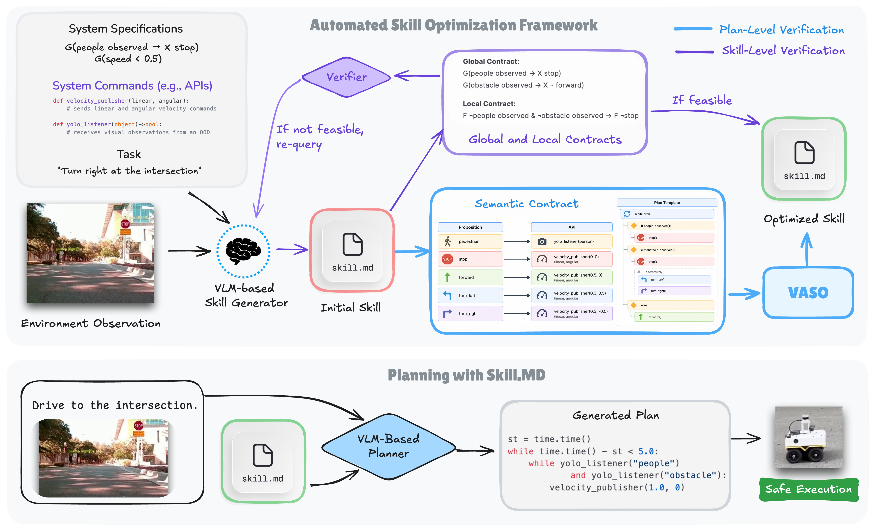
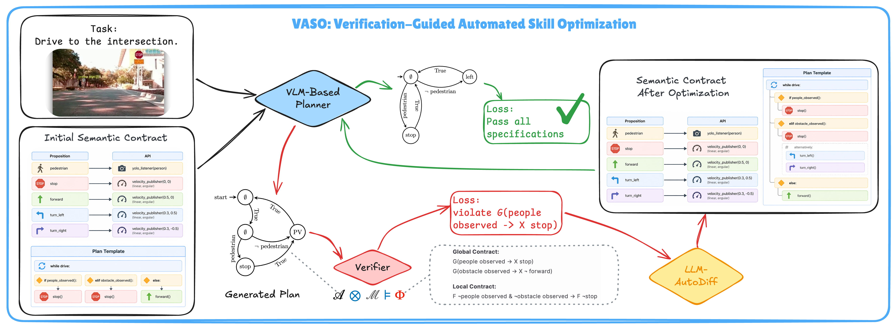

# Automated Skill Optimization via Formal Verification for Embodied Agents

<p align="center">
  
</p>

<p align="center">
  <em>Overview of the proposed skill optimization framework.</em>
</p>

---

## Overview

We propose a framework for **automatic skill discovery and optimization** with foundation models under formal verification. The framework represents skills using:

- **Global Contracts:** safety specifications shared across all skills,
- **Local Rules:** skill-specific behavioral constraints,
- **Semantic Contracts:** text-based instructions used to guide foundation model planning.

We build a closed-loop optimization pipeline where:

1. Foundation models generate skills and plans,
2. Formal verification checks correctness against temporal logic specifications,
3. Verification feedback iteratively refines the semantic contract.

The framework enables skill optimization **without gradient-based fine-tuning or manual labeling**, improving both planning reliability and specification compliance.

---

## Repository Structure

```text
.
├── VASO.ipynb
├── direct-query-baseline.ipynb
├── model-checking.py
├── examples
│   ├── pipeline.png
│   ├── vaso.png
│   ├── jackal-skill-example.md
│   ├── px4-skill-init-example.md
│   ├── px4-skill-final-example.md
│   ├── sample_model_simple.smv
│   ├── sample_ltl_short.txt
│   └── sample_plan.py
```

### Main Files

#### `VASO.ipynb`

Main implementation of the verification-guided skill optimization pipeline.

Includes:

- skill generation,
- semantic contract refinement,
- verification-guided optimization,
- evaluation on generated plans.

---

#### `direct-query-baseline.ipynb`

Baseline implementation using direct plan generation without skill optimization.

Used for comparison against the VASO optimization framework.

---

#### `model-checking.py`

Utility for formal verification using model checking.

The script verifies generated plans against temporal logic specifications.

---

## Optimized Skill Examples

The repository includes optimized skill examples for different robotic platforms:

| File | Description |
|---|---|
| `examples/jackal-skill-example.md` | Optimized navigation skill for the ClearPath Jackal ground robot |
| `examples/px4-skill-init-example.md` | Initial PX4 semantic skill contract before verification-guided refinement |
| `examples/px4-skill-final-example.md` | Final verified PX4 skill contract satisfying temporal logic specifications |

These examples illustrate the progressive refinement of PX4 semantic contracts through verification-guided optimization.


## Model Checking

Run formal verification with:

```bash
python model-checking.py \
    --model_path examples/sample_model_simple.smv \
    --spec_path examples/sample_ltl_short.txt \
    --code_path examples/sample_plan.py
```

### Arguments

| Argument | Description |
|---|---|
| `--model_path` | NuSMV transition system model |
| `--spec_path` | Temporal logic specification file |
| `--code_path` | Generated executable plan |

---

## Example Pipeline

<p align="center">
  
</p>

<p align="center">
  <em>Verification-guided skill optimization loop.</em>
</p>

---

## Key Features

- Automatic skill discovery with foundation models
- Structured and verifiable skill representation
- Verification-guided semantic contract refinement
- Plan-level temporal logic verification
- No gradient-based fine-tuning required
- Improved compliance and convergence efficiency

---

## Citation

```bibtex
@article{vaso2026,
  title={Automated Skill Optimization via Formal Verification for Embodied Agents},
  author={Anonymous},
  year={2026}
}
```

---

## License

MIT License