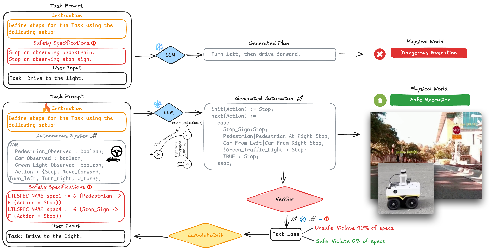

# LLM-Automatic Differentiation via Verification Feedback (LAD-VF)

This repository contains the code and experiments for our work on **LLM-Automatic Differentiation Enables Fine-Tuning-Free Robot Planning from Formal Methods Feedback** for safe and adaptive robot planning. We implement a fine-tuning–free framework that integrates **automatic prompt engineering** with **formal verification feedback** to improve safety-constrained robot planning.  

## Overview

Our method treats every textual input to an LLM application (prompts, instructions, few-shot examples) as trainable parameters within a differentiable pipeline. Verification outcomes (e.g., number of violated specifications) are converted into structured losses and propagated backward to refine prompts. This enables **safety compliance, interpretability, and scalability** without costly fine-tuning.
Our approach combines:
- **Verification feedback** to enforce compliance with task specifications and obtain compliance labels without human annotations.  
- **Efficient prompt optimization** to steer pre-trained LLMs without parameter updates. 

## Repository Structure

- **Main Pipeline**: [`adalflow_driving_prompt_opt.ipynb`](adalflow_driving_prompt_opt.ipynb)  
  Implements the **LAD-VF pipeline**, where formal verification outcomes guide prompt optimization.  
  - Generates NuSMV-based plans for autonomous driving tasks.  
  - Applies model checking against temporal-logic safety specifications.  
  - Uses verification results as supervision signals to refine prompts iteratively.  

- **Baseline (TextGrad)**: [`textgrad_driving_prompt_opt.ipynb`](textgrad_driving_prompt_opt.ipynb)  
  Implements the **TextGrad baseline** for comparison. TextGrad backpropagates textual gradients but struggles with sequential decision-making. 

- **Prompt+Spec**: [`manual_prompt.ipynb`](manual_prompt.ipynb)  
  A simple prompting baseline where the natural language task description and a set of specifications are directly provided to the LLM.

## Setup

Please input your OpenAI API Key in [`common.py`](common.py)  
